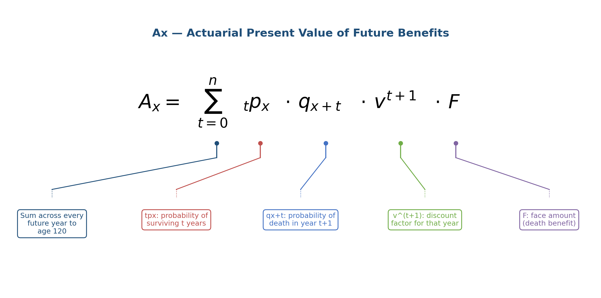
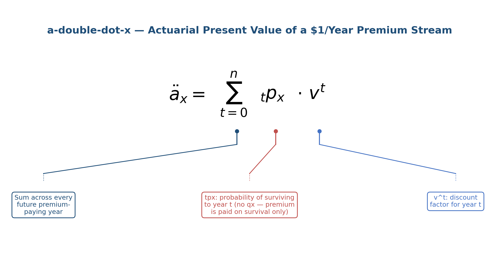
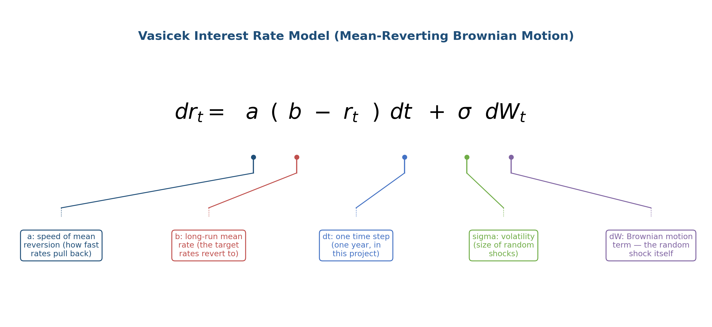

# Stochastic Whole Life Reserve Model

## Overview

Actuarial Science is the study of risk and finance from the perspective of an insurance company. An actuary has a major role in many functions within an insurance company such as the pricing of insurance products, calculation of policy liability, investment management, and the subject of this project: reserving.

A reserve is a measure of the total liability an insurance company holds with respect to the cash value or death benefits tied policies accrue. It sits as the single biggest liability line item on an insurance company's financial statement, meaning that accurate reserve valuations are needed for an insurance companies to prove solvency, as well as guarantee the ability to pay out future claims.

Actuaries learn the math behind performing these calculations through a series of credentialing exams. These exams, however, assume several constants. For reserve valuation in an exam setting, discount rates, lapse, and mortality are all static. Yet in the real world, randomness plays a role in this valuation, as mortality, lapse, and interest rates are not necessarily derived from a static table.

One of the main purposes this project serves is to demonstrate the difference between this stochastic method, and the deterministic pricing logic used in Actuarial exams. As such, the inputs for the reserve formula, interest rate, mortality, and lapse assumptions – are all randomized from period to period allowing a look at the trend in reserves as these different assumptions change. My analysis also includes a look at the tail risk of these assumptions, analyzing the "worst case" scenarios that an insurance company could find itself in. In testing, a policy book that was priced at a deterministic break even, meaning reserves were $0 at time 0, required a tail-scenario capital equal to 9.7% of tala face amounts, which was not captured by deterministic pricing alone. 

## Motivation

Tools like AXIS and Prophet make complex reserve calculation and liability valuation attainable for companies, but many actuarial students lack access to the software commonly used within the industry. Rather than wait until I could use these technical tools to perform reserve valuation, I decided to build a tool that would allow me that experience.

Ive also become very passionate about work with asset management and complex securities, and saw this project as a good gateway into this field of research, giving me familiarity with complex modeling processes.

I also think it's an interesting exercise to show how Python and Excel can be connected. As Python can clean and scrub data, transform it, and then produce deliverables in Excel format, provided you work with the openpyxl framework.

## What's Modeled

- A randomized mortality table with assumptions built on the 2017 CSO Ultimate table
- Duration-based lapse assumptions, with lapse tables decaying over time into an ultimate rate
- A mean-reverting stochastic interest rate through a Vasicek time series model
- Randomized mortality and lapse shocks, occurring independently on a per-policy basis
- A reserve projection that runs to terminal age or a fixed window
- Book-level aggregation of data across a policy portfolio
- Per-policy premium calibration via the equivalence principle
- Excel import with data cleaning, and Excel export functions
- VaR and CVaR tail risk reporting, showing the upper limit of liabilities

## Methodology — The Reserve Equation

The mathematics used throughout this project focus around the Actuarial Life Reserve equation; math generally reserves for students studying the for the FAM (Fundamentals in Actuarial Mathematics) exam. One of the many resources I used throughout this process.

The pieces of these equations are built out of a life table- the heart of actuarial life insurance. The life table itself is constructed through the mortality table, which displays the probability of dying at a given age. This initial input is then used to derive the rest of the table. The common values displayed in a life table are as follows:

- **qx** is the mortality rate at a given age x
- **px** is the probability of surviving at age x
- **tpx** is the probability of surviving t full years from age x, or the cumulative product of px
- **lx** is the size of a hypothetical population alive at a given age, beginning at a radix of 100,000 representing the starting population
- **dx** is the number of deaths in a given period, based on the number of living insureds; can also be written as lx − lx+1

In my code, I defined a new term, **combined px**, which considers the probability of surviving both mortality and lapse as two separate decrements. The tpx used throughout this project is built from this combined px, not mortality alone.

Life tables are used to source the variables that feed into the reserve formula, all of which are denoted above.



**Ax** denotes the actuarial present value of future benefits — the probability of surviving to a given year, times the probability of death that year, times the payout. Because I set the max horizon at 120, the payout automatically occurs if an insured reaches that age. Policies with endowments could adjust this horizon further, with mortality effectively becoming a certain occurrence at a given age.

**P** is the level annual premium.



**äx** ("a-double-dot-x") is the present value of premiums. The main difference between Ax and äx is that the premium consideration is contingent purely on survivorship—it includes only the tpx term, not qx, since a premium is paid only if the policyholder is alive.

### Negative Reserves

The reserve itself is **APV(future benefits) − APV(future premiums)** — a relationship that made it difficult to randomly generate policy information. In my initial runs of the policy book, the function had premiums set too high relative to the face amount of the policy, which produced a negative reserve. One initial remedy was to add a reserve minimum of 0 for every policy. If premiums paid on the policy are overpriced, the policy would net to zero rather than decreasing reserves at the book level.

During the final validation runs, I noticed an error in how premiums were calculated at the policy level. Premiums were still overstated in the Excel workbook I used because I applied a flat percentage to the block of policies rather than weighing them for duration, collected premium, and cash value. As a result, individual policies could zero out because my calculation weighted premiums too heavily.

To fix this problem, I researched valuation techniques and implemented the equivalence principle. Each policy's true net level premium is solved by setting APV(future benefits) equal to premium × äx and then used a loading factor to assume expenses and profit. True net level premium now scales with age over a full policy lifetime, starting at about 0.207% of face and increases over time to 3.592%. This method corrected the overpricing of older policies and underpricing of younger policies, as well as eliminating the zeroing out issue in individual policy reserves.

### A Note on Duration vs. Attained Age

Lapse is a duration-based calculation, meaning that as soon as a policy is in force, it begins pulling values from a lapse table indexed by policy duration. Mortality is based on both issue age and attained age. In other words, an insured with a policy issued at age 5 versus one issued at age 40, at the same duration, would share similar lapse assumptions but very different mortality assumptions, because of the difference in actual age.

## Randomization Methodology

Bonds, loans, annuities, and other securities have closed-form formulas used to calculate their value under deterministic assumptions. Reserves are no different — there is indeed a closed-form formula, as discussed above. The complication is that once you begin randomizing the inputs, your answers no longer collapse into a closed-form solution. A formerly deterministic path now has several deviations, with each run of the model producing one new data point you can distribute. The randomization mechanism you choose drives the output of your model — not just the shape of the resulting distribution, but whether randomization is applied uniformly, per policy, or per step in time.

Each randomized input in this project has defensible reasoning behind the methodology for modeling.

### Mortality Randomization

Mortality is randomized through lognormally distributed shocks in each period, rather than the same normally distributed randomization used for interest rates. This choice prevents mortality from going negative in any period. Claim severity is conventionally modeled with a similar assumption: lognormal distributions prevent claims from going negative while also skewing the distribution to the right, matching real-world claims behavior.

### Lapse Randomization

I built two lapse randomizers for this project, the latter of which I chose for the sake of modeling accuracy and legitimate grounding in ALM practice.

Lapse is a term tied to the probability of a policy falling off an insurance company's books. This can happen for multiple reasons — non-payment or surrender — but unlike a variable like mortality, lapse is rational in nature. Lapse rates driven by policyholder behavior respond to macroeconomic changes such as changes in interest rates. Higher interest rates can lead to a larger number of lapses as policyholders choose to surrender their policies in favor of higher-yield investments. This phenomenon is known as disintermediation risk, which is a concern insurance companies must grapple with during high-interest rate scenarios. During these periods of high rates, not only do bond prices drop, but lapse itself can pose a massive risk to an insurance company's bottom line.

Lapse, in this project, is modeled with the assumption that higher rate scenarios will drive lapse behavior, with the dynamic lapse function I built taking the mean of interest rates in each rate path and adjusting the lapse assumption accordingly on a per-policy basis. In doing so my reserving model can show the adverse effect of disintermediation risk, when rates get higher, lapse rates do as well.

Mortality, because it was computed on a per policy basis had always been idiosyncratic since the start of my project. Each policy got a uniquely random factor applied to it that no other polices share. The lapse shocks were initially systemic, with a dynamic shift correlating every policy with the interest rate. The idiosyncratic noise term allows for independence on top of the general trend the book of business shares that it responds to higher interest rates. Insurance companies often consider the variance of a book of business rather than on a per policy basis because of the fact comparing policies would show a higher level of Variance. Risk for an individual policy is more likely to shrink as you consider the block of policies, reverting to an average variance as the law of large numbers is applied. These elements of classical portfolio theory form the justification for looking at VaR and CVaR at the book level rather than change in reserve on a policy-by-policy basis. The aggregate effect of mortality and lapse one the entire book will be vastly different than on a policy-by-policy basis.

### Interest Rate Randomization

I chose to use normally distributed shocks to randomize the interest rate assumption, reflecting the principle of Brownian motion often used in stochastic calculus for pricing stock options. This assumption allows for both positive and negative rate movements, which exposes an inherent limitation of the Vasicek model: interest rates in each period could become negative.



In real-world scenarios, the American Federal Reserve would generally not allow rates to drop below 0, as this would disrupt the broader economy — meaning my model could be somewhat inaccurate in extreme low-rate scenarios. This is an issue I plan to correct in future iterations of the project, specifically through the implementation of the Hull-White model, bootstrapped off a real Treasury curve.

## Convergence

The following table shows convergence toward a stable mean reserve after simulating n = 200, 500, 1,000, 5,000, and 10,000:

```
n=   200: mean= -13532.20  std=  6649.85  95% VaR=  -6752.93
n=   500: mean= -13742.82  std=  6793.60  95% VaR=  -6622.56
n=  1000: mean= -13444.34  std=  6369.91  95% VaR=  -6526.60
n=  5000: mean= -13483.20  std=  6420.15  95% VaR=  -6664.13
n= 10000: mean= -13322.99  std=  6344.72  95% VaR=  -6623.58
```

There is a clear trend toward a stable mean, generally sitting between roughly -13,322.99 and -13742.82 across every simulation count tested. The point of this exercise was to determine the value of N that included the least amount of statistical noise while still running in a reasonable amount of time. I settled on 10,000 as the upper limit for this project, since the percent change between 1,000 and 10,000 simulations was minimal relative to the additional processing time required.

## Other Assumptions

**2017 CSO Mortality, Ultimate Table** — Mortality values for this project were sourced from the SOA, using ultimate mortality rates only. A policy's reserve is partially dependent on underwriting: newly issued business written under strict underwriting guidelines carries a lower mortality risk, since the extra effort spent validating an insured's health allows an insurer to assume a significantly lower probability of death after issue. Because this model uses ultimate rates, it would likely overstate reserves for newly issued policies compared with a full select-and-ultimate approach.

**Lapse** — I used the publicly available shape of a lapse curve informed by the LIMRA/SOA combined lapse persistency study to validate the general shape of the lapse assumption used in this project.

**Interest Rates** — The interest rates for the Vasicek model were chosen illustratively, rather than pulled from a live market curve. This is a planned future improvement, alongside the addition of the Hull-White model working in tandem with Vasicek.

**Product** — Traditional whole life insurance: a fixed face amount with a level annual premium.

## Model Parameters

| Parameter | Value | Description |
|---|---|---|
| **Vasicek — start_rate** | 4.5% | Starting interest rate for each simulated path |
| **Vasicek — long_run_mean** | 4.5% | Long-run mean the interest rate reverts toward |
| **Vasicek — speed** | 0.05 | Speed of mean reversion |
| **Vasicek — annual_vol** | 1.0% | Annual volatility of the interest rate shock |
| **shock_std_mort** | 0.05 | Standard deviation of the lognormal mortality shock (multiplicative) |
| **shock_std_lapse** | 0.005 | Standard deviation of the lapse shock, before dynamic adjustment |
| **Dynamic lapse sensitivity** | 2.0 | Multiplier applied to a simulation's interest rate deviation from the long-run mean, when shifting lapse |
| **Reserve floor** | $0 | Minimum reserve held per policy, consistent with statutory practice |
| **Premium calibration** | Equivalence principle, per policy | Each policy's own net level premium, computed from its own age-specific mortality and lapse cost |
| **Terminal age / max horizon** | 120 | Age at which the death benefit payout is treated as certain |
| **Final simulation count (N)** | 10,000 | Chosen based on convergence testing (see Convergence section) |

## Validation

I wrote a validation script that runs each of the core functions in this project to determine whether the outputs are both reasonable and accurate.

The first and simplest of these validations is the life table itself: lx − dx at every period equals lx+1 for the following period, confirming that at every time interval, the population correctly decreases by the number of deaths recorded that year.

The convergence test showed that, for a single-policy reserve under the Monte Carlo simulation, the mean total reserve consistently fell between -13,275 and -13,854 across all tested simulations, confirming the overall stability of the Monte Carlo process.

Using the same random seed produced identical results for the deterministic reserve benchmark. A random seed was used throughout testing — it forces every random variable to be generated in the same sequence any time randomness is needed, which makes testing reproducible. With the random seed fixed and every shock standard deviation set to zero, the model produced identical results run over run. This outcome confirms that randomness in the model comes entirely from the seeded random number generator, and not from any uncontrolled source of variability.

Testing for interest rate, mortality, and lapse sensitivity revealed that increased interest rate volatility pushes the standard deviation of the reserve distribution significantly wider — nearly 2,000% wider between the low- and high-volatility test cases.

To parse out whether mortality was randomized correctly, I built another function to only consider the APV(benefits) side of the reserve equation. This clearly illustrated the impact of mortality on the equation assuming a constant lapse rate, an impact that becomes drowned out when considering the entire reserve. Because APV(Benefits) and APV(Premiums) both depend heavily on survivorship, which is primarily driven by lapse and interest rate assumptions, with mortality holding less weight in the equation. The difference driven by high or low mortality shocks is negligible when measured across the entire policy book.

Dynamic lapse rates trended similarly to interest rate sensitivity, with a higher sensitivity setting pushing average lapse meaningfully higher under a high-rate scenario.

CVaR at the book level was higher than VaR, which makes mathematical sense: VaR is computed at the 95th percentile of the output distribution, marking the threshold beyond which the worst 5% of scenarios occur. CVaR then averages every scenario within that worst 5% — meaning it should always be at least as severe as VaR itself, which the test results confirm.

The final test, now included in the suite, compares deterministic reserving against stochastic tail risk, showing how random shocks can cause a large deviation from deterministic pricing assumptions. Premiums are calibrated through the equivalence principle, so every deterministic policy reserve is $0 at issue. The stochastic simulation, however, shows that 95% CVaR equals 9.7% of the book's total face amount. This hidden risk in deterministic pricing is entirely overlooked by that methodology, showing the value of the stochastic reserving process, which captures the aggregate risk across changing lapse, mortality, and interest rate assumptions. 

```
--- Test 1: Life Table Identity Check (lx - dx = lx+1) ---
lx - dx = lx+1 holds for all rows: True

--- Test 2: Monte Carlo Convergence (N = 200 to 10,000) ---
n=   200: mean= -13532.20  std=  6649.85  95% VaR=  -6752.93
n=   500: mean= -13742.82  std=  6793.60  95% VaR=  -6622.56
n=  1000: mean= -13444.34  std=  6369.91  95% VaR=  -6526.60
n=  5000: mean= -13483.20  std=  6420.15  95% VaR=  -6664.13
n= 10000: mean= -13322.99  std=  6344.72  95% VaR=  -6623.58

--- Test 3: Deterministic Benchmark (shock_std = 0) ---
Reserve, run 1: -12157.78
Reserve, run 2: -12157.78
Reproducible with zero shocks and matched seed: True

--- Test 4: Interest Rate Volatility Sensitivity ---
Low annual_vol (0.005)  std dev: 3004.65
High annual_vol (0.03)  std dev: 59081.71
Higher volatility widened the distribution: True

--- Test 5: Mortality Shock Sensitivity (benefit-side isolated) ---
Low shock_std_mort (0.01)  std dev: 0.36
High shock_std_mort (0.15) std dev: 5.49
Higher mortality shock widened the distribution: True
Note: this isolates the benefit-side APV, holding lapse static and excluding the
premium leg. Testing the full reserve (benefit - premium) masks mortality's effect,
since both legs share the same survivorship (combined_px) -- a mortality shock's
impact on the benefit term is partially offset by its correlated impact on the
premium term. Isolating the benefit leg removes this structural cancellation.

--- Test 6: Dynamic Lapse Rate-Responsiveness ---
Avg lapse rate, low-rate scenario  (2%): 0.0099
Avg lapse rate, high-rate scenario (8%): 0.1168
Higher rates produced higher lapse, as expected: True

--- Test 7: Book-Level VaR / CVaR Tail Direction Check ---
All book reserves non-negative (floor working): True
95% VaR:  144,335.84
95% CVaR: 205,064.52
CVaR is more severe than VaR (CVaR >= VaR): True

--- Test 8 Deterministic vs. Stochastic Reserve Gap ---
Deterministic book reserve at issues: 0.00
Total book face amount: 2,115,000.00
95% CVaR as % of total face amount: 9.70
Book priced to exact deterministic break even, but 95% CVaR required capital equal to 9.7% of total book face amount.

VALIDATION SUITE COMPLETE
```

## Future Directions

While working through this project, I identified four main directions to take it in going forward.

**First**, as previously discussed, updating the interest rate assumption by adding varying models a user of this application could select from would add both modeling depth and accuracy.

**Second**, to optimize runtime, vectorization is a natural next step. Essentially, this would mean restructuring the core variables into arrays numpy can operate on directly, requiring significantly less processing power than the constant looping most of the current functions rely on.

**Third**, adding the ability for policies to be evaluated based on their actual in-force date, rather than assuming an entire book of business was issued at the same point in time.

**Fourth and finally**, converting the project into a web application that allows for easier data input — turning this from code an actuarial student could run into a tool actuarial students could use to practice the process of reserve valuation directly.

## Final Notes on Workflow

This project was challenging. It tested a lot of my mathematical and programming knowledge in ways that were both expected — loud bugs and syntax issues — and unexpected, in the form of quieter errors. Most of my debugging time was spent tracing through hidden bugs: numbers that looked correct on the surface but carried genuine errors underneath.

Going through the process of fact-checking each piece, testing, and iterating through trial and error taught me a great deal about the process of coding from top to bottom, and gave me real insight into the kinds of errors that persist in this field even once code appears to run cleanly. At its core, modeling needs to be accurate, and finding ways to test for that accuracy — confirming that results are correct, not just that they look right — is a skill I've become much more comfortable with through this project.

I am excited to keep working on this project, and I have several ideas for future projects beyond this valuation tool.

Thank you for taking the time to read all of this. If you notice any errors within the code, run into any bugs, or have further questions, please don't hesitate to reach out.

## Usage

```python
import numpy as np
import pandas as pd
from pymort import MortXML
from Acsci_proj_final import (get_qx_for_policy, implied_net_level_premium, calibrate_book_premiums, build_extended_lapse_table, randomize_mortality, randomize_lapse, randomize_lapse_dynamic, simulate_rate_path_vasicek, simulate_n_paths, simulate_one_reserve, reserve_for_one_path, simulate_one_book_reserve, run_full_book_simulation)

np.random.seed(42)

xml = MortXML.from_id(3282)
mortality_rates = xml.Tables[1].Values['vals'].tolist()

base_lapse = [0.1620, 0.1185, 0.0962, 0.0817, 0.0698, 0.0613, 0.0554, 0.0506, 0.0471, 0.0442, 0.0415, 0.0398, 0.0376, 0.0361, 0.0347, 0.0335, 0.0324, 0.0316, 0.0307, 0.0299, 0.0290, 0.0285, 0.0278, 0.0272, 0.0267, 0.0261, 0.0257, 0.0253, 0.0248, 0.0244]

start_rate, long_run_mean, speed, annual_vol = 0.045, 0.045, 0.05, 0.01
shock_std_mort, shock_std_lapse = 0.05, 0.005
n_years = 30

# Build a sample book, then calibrate each policy's premium to its own
# equivalence-principle net level premium (see Methodology section above)
sample_book = pd.DataFrame({
    'policy_id': [f'POL{i}' for i in range(10)],
    'issue_age': [25, 30, 35, 40, 45, 50, 55, 60, 65, 70],
    'face_amount': [150000, 200000, 250000, 180000, 220000, 300000, 175000, 240000, 190000, 210000],
})
sample_book = calibrate_book_premiums(sample_book, mortality_rates, base_lapse, start_rate)

result = run_full_book_simulation(200, start_rate, long_run_mean, speed, annual_vol, n_years, sample_book, mortality_rates, base_lapse, shock_std_mort, shock_std_lapse)
print("Mean book reserve:", result.mean())
```

*(The full validation suite — 7 tests covering life table identity, Monte Carlo convergence, deterministic benchmarking, and sensitivity checks across every major assumption — is included as `run_validation_suite.py` and referenced in full in the Validation section above.)*
